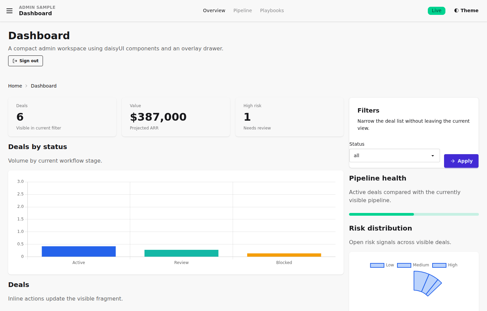
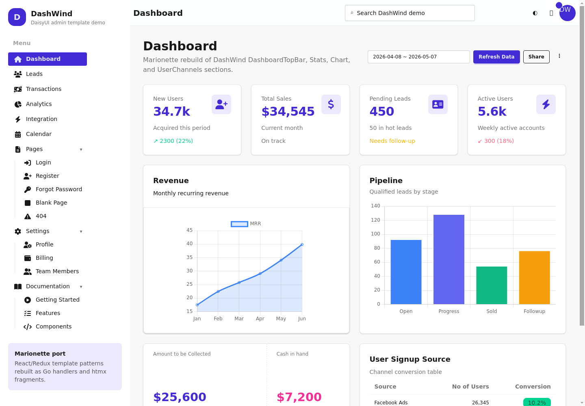

# Marionette

[日本語](README.ja.md) | English


Marionette is a **Go-first framework that makes admin UI and internal tool development dramatically simpler**.
It lets you describe screens, state, and actions end-to-end in Go, while htmx handles
fast partial updates in the browser.
It is also AI-friendly: by keeping that workflow in one place, Marionette reduces cross-stack context, creates fewer boundaries, and helps you work with less frontend complexity.

If your team is tired of maintaining frontend and backend separately, Marionette gives you
a **practical, operations-friendly UI architecture** built for real product teams.

## Why Marionette

- Build operational UI without leaving Go.
- **AI-friendly by design**: Reduce language boundaries, API schema handoff, frontend/backend synchronization, and state synchronization by keeping operational UI flows in Go.
- Keep routing, state updates, and event handlers on the server.
- Use htmx-powered partial rendering instead of maintaining a full SPA.
- Compose admin screens from pages, forms, actions, tables, charts, and layout components.
- Share a single `DataQueryState` between charts and tables so clicking a region filters all widgets together.
- Run the same app as a web UI or inside a desktop WebView shell.

## AI-friendly context compression

Marionette is designed around context compression rather than unverified token metrics. Keeping screens, state transitions, and action handlers in Go means fewer boundaries between backend and frontend work, less schema handoff, and less context switching when you describe changes to AI tools. As a result, teams can often keep prompts and reviews focused on the product flow instead of re-explaining how multiple stacks coordinate. Read the full [AI-friendly architecture guide](https://yoshihideshirai.github.io/marionette/en/ai-friendly/) for the structural details.

- **No TypeScript build chain required for the core app**: Marionette keeps application logic on the Go side and uses htmx for browser partial updates, so the core app does not need a TypeScript toolchain. This is not a promise to eliminate all client JavaScript; shared browser helpers such as overlays may still exist for presentation behavior. New `.ts` / `.tsx` files remain prohibited by the [UI architecture policy](docs/architecture/ui.md#2-new-typescript-files).

## Great fit for teams that

- Want to stay backend-first in Go and reduce frontend maintenance overhead.
- Need to ship admin/operations interfaces quickly without committing to a full SPA stack.
- Care about server-side observability, access control, and debugging ergonomics.
- Want flexibility to deploy as browser UI today and desktop shell later.

## Try it in 1 minute

Run the representative admin sample:

```bash
go run ./cmd/admin-sample
```

Then open http://127.0.0.1:8082.



Source: [`cmd/admin-sample/main.go`](cmd/admin-sample/main.go)

Run the DashWind-style DaisyUI dashboard demo inspired by [`robbins23/daisyui-admin-dashboard-template`](https://github.com/robbins23/daisyui-admin-dashboard-template):

```bash
go run ./cmd/dashwind-demo
```

Then open http://127.0.0.1:8083.



Source: [`cmd/dashwind-demo/main.go`](cmd/dashwind-demo/main.go), [`internal/dashwinddemo/app.go`](internal/dashwinddemo/app.go)

Minimal DashWind setup registers the DaisyUI template, DashWind CSS, and browser helpers with one call:

```go
app := mb.New()
dw.Use(app, dw.Options{})
```

Run the full demo:

```bash
go run ./cmd/marionette
```

Then open http://127.0.0.1:8080.

Run the minimal sample:

```bash
go run ./cmd/simple-sample
```

Then open http://127.0.0.1:8081. The sample is self-contained in [`cmd/simple-sample/main.go`](cmd/simple-sample/main.go).

Run the AI chat sample demo (simulated streaming replies, no external API key required):

```bash
go run ./cmd/ai-chat-sample
```

Then open http://127.0.0.1:8084. The sample is self-contained in [`cmd/ai-chat-sample/main.go`](cmd/ai-chat-sample/main.go).

Run the desktop WebView sample:

```bash
go run -tags marionette_desktop ./cmd/marionette-desktop
```

The desktop runtime uses the same Marionette app model behind a localhost
server and native WebView shell. On Linux, install GTK 3 and WebKitGTK
development packages before building the desktop tag.

## Documentation

The README is intentionally small. Use the documentation site for tutorials,
API details, and component examples:

- Docs site: https://yoshihideshirai.github.io/marionette/
- Tutorial: https://yoshihideshirai.github.io/marionette/en/tutorial/
- API docs: https://yoshihideshirai.github.io/marionette/en/api/
- Components gallery: https://yoshihideshirai.github.io/marionette/en/components/
- AI-friendly architecture: https://yoshihideshirai.github.io/marionette/en/ai-friendly/
- State management guide: [docs/state-management.md](docs/state-management.md)

Japanese docs are available from the language switcher on the site.

## Development

Use [Air](https://github.com/air-verse/air) to restart the demo app when Go
files change:

```bash
go install github.com/air-verse/air@latest
air
```

Run the documentation site locally:

```bash
cd docs/site-astro
npm install
npm run dev
```

The GitHub Pages workflow publishes `docs/site-astro/` via GitHub Actions.

## Component template placement

- The canonical component template directory is `templates/components/`.
- `frontend/components_template_loader_impl.go` resolves component templates from this directory via `internal/componenttmpl`.
- Name templates as `components/<basename>` (for example: `components/link`, `components/button`), where `<basename>` is the file name without `.tmpl`/`.html`.

## Heavy Job Template (data apps)

`cmd/marionette` includes a sample "Run aggregation" flow on the Analytics page:

- Server-side `Job` model: execution ID, state, progress, and result reference.
- UI templates combined for lifecycle UX:
  - `progress` while running,
  - `toast` for status/alerts,
  - `empty_state` before first run.
- In-memory cache keyed by input-parameter hash, with TTL (3 minutes), to speed up same-condition reruns.

### Retry and timeout policy

- Retry: one automatic retry is applied for transient failures (max 2 attempts total).
- Timeout: job budget is 5 seconds; if processing exceeds this budget, mark as failed.
- Failure handling: surface error in toast and allow operator to rerun with same or adjusted parameters.
